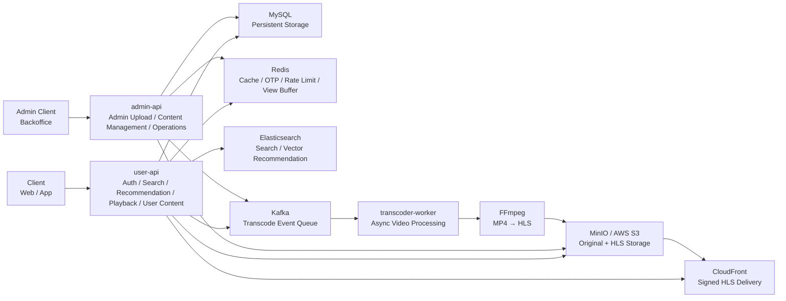

# U+ OTT 플랫폼 백엔드

> 정식 콘텐츠 스트리밍과 유저 숏폼 클립을 함께 제공하는 멀티 콘텐츠 OTT 서비스

[](LICENSE)
[](https://openjdk.org/)
[](https://spring.io/projects/spring-boot)
[](https://www.mysql.com/)
[](https://redis.io/)
[](https://www.elastic.co/)
[](https://kafka.apache.org/)
[](https://www.docker.com/)

**기간**: 2025.02.04 ~ 2025.03.19 (6주) &nbsp;|&nbsp; **팀 규모**: 백엔드 7명

---

## 프로젝트 소개

### 기획 배경

LG U+ 모바일TV의 영화 리뷰 유튜브 플레이리스트에 주목했다. 유저가 직접 올리는 영화·드라마 관련 숏폼 콘텐츠를 OTT 플랫폼 내부에 끌어들이면, 사용자가 관련 영상을 보고 바로 본 콘텐츠를 시청하는 자연스러운
흐름을 만들 수 있다는 아이디어에서 출발했다.

여기에 현대 사용자의 숏폼 소비 트렌드를 결합해, **"플랫폼이 제공하는 오리지널 콘텐츠 + 사용자가 업로드하는 크리에이터 숏폼"** 을 하나의 서비스에서 제공하는 투트랙 전략을 설계했다. 소비자가 곧 창작자가 되는
선순환 구조를 통해 콘텐츠 생태계를 자생적으로 성장시키는 것이 목표다.

> 전형적인 OTT를 만들면 차별성이 없다는 피드백 이후, 유튜브 Shorts 방식의 숏폼과 넷플릭스 방식의 OTT를 융합한 구조로 방향을 전환했다.

### 협업 방식

| 도구                 | 용도                                 |
|--------------------|------------------------------------|
| **Jira**           | 스프린트 이슈 관리 및 일정 추적                 |
| **GitHub**         | PR 기반 코드 리뷰 + Swagger 기반 API 명세 공유 |
| **Slack / Notion** | 실시간 소통 및 회의록·설계 문서화                |
| **데일리 스크럼**        | 매일 진행 상황 공유 → 전체 타임라인 안정적 유지       |

---

## 팀 구성

|                                                        김우식                                                        |                                                           서수민                                                           |                                                           우수정                                                           |
|:-----------------------------------------------------------------------------------------------------------------:|:-----------------------------------------------------------------------------------------------------------------------:|:-----------------------------------------------------------------------------------------------------------------------:|
| <br/>[@rladntlr](https://github.com/rladntlr) | <br/>[@s0ooooomin](https://github.com/s0ooooomin) | <br/>[@soojung122](https://github.com/soojung122) |
|                                                    **Backend**                                                    |                                                       **Backend**                                                       |                                                       **Backend**                                                       |
|                                         회원/인증 · 검색/추천<br/>장애 Fallback 설계                                          |                                                  콘텐츠 · 플레이어<br/>더미데이터                                                   |                                                      인증/회원 · 백오피스                                                       |

<br/>

|                                                         조성재                                                          |                                                     최가은                                                     |                                                            최보근                                                             |                                                      한상옥                                                       |
|:--------------------------------------------------------------------------------------------------------------------:|:-----------------------------------------------------------------------------------------------------------:|:--------------------------------------------------------------------------------------------------------------------------:|:--------------------------------------------------------------------------------------------------------------:|
| <br/>[@seongejae](https://github.com/seongejae) | <br/>[@eunii2](https://github.com/eunii2) | <br/>[@ChoiBoKeun1](https://github.com/ChoiBoKeun1) | <br/>[@kay0307](https://github.com/kay0307) |
|                                                     **Backend**                                                      |                                                 **Backend**                                                 |                                                        **Backend**                                                         |                                                  **Backend**                                                   |
|                                               검색 고도화 <br/>마이페이지 / 사용자                                                |                                          백오피스 · 콘텐츠<br/>트랜스코딩&ABR                                           |                                                콘텐츠 · 플레이어<br/>실시간 인기차트 · 배포                                                |                                            마이페이지/플레이어성능<br/>테스트 시연                                             |

---

## 배포

|                 | URL                                                    |
|-----------------|--------------------------------------------------------|
| **Frontend**    | https://utopiaott.vercel.app                           |
| **Backend API** | https://ureca-utopia.duckdns.org                       |
| **Swagger**     | https://ureca-utopia.duckdns.org/swagger-ui/index.html |

---

## 기술 스택

| 분류                   | 기술                                                  |
|----------------------|-----------------------------------------------------|
| Language / Framework | Java 21, Spring Boot 4, Spring Security 6           |
| Database             | MySQL 8.4 + Flyway, Redis 7, Elasticsearch 8 (Nori) |
| Messaging            | Apache Kafka 3.7 (KRaft)                            |
| Storage / CDN        | AWS S3, AWS CloudFront, FFmpeg                      |
| Infra                | Docker, Docker Compose, GitHub Actions              |

---

## 시스템 구성



| 모듈                  | 역할 및 책임                           | 주요기능                                                                          |
|---------------------|-----------------------------------|-------------------------------------------------------------------------------|
| `core`              | JWT·OAuth 보안, 스토리지 추상화, Kafka 이벤트 | JWT/OAuth2 보안 설정, Redis/Kafka 설정, S3/MinIO 스토리지 추상화 인터페이스, 공통 예외 처리           |
| `domain`            | JPA 엔티티·리포지토리 (공유 도메인)            | JPA 엔티티 정의, Querydsl 리포지토리, 공통 서비스 로직 (사용자, 영상 메타데이터 등)                       |
| `user-api`          | 사용자 API 서버                        | 영상 스트리밍 URL 생성(CloudFront Signed URL), 콘텐츠 검색(Elasticsearch), 캐싱 처리, 마이페이지 관리 |
| `admin-api`         | 관리자 API 서버                        | 신규 콘텐츠 업로드, 트랜스코딩 작업 트리거(Kafka Message 발행), 대시보드 및 통계 관리                      |
| `transcoder-worker` | 비동기 영상 트랜스코딩 워커                   | Kafka로부터 인코딩 메시지 수신, FFmpeg을 활용한 HLS 세그먼트 생성 및 S3 업로드                         |

---

## 주요 기능

### 인증

- 이메일 회원가입 4단계 멀티스텝 (Setup Token으로 서버 세션 없이 상태 전달)
- 소셜 로그인 (Google / Kakao / Naver), JWT Access(30분) + Refresh(14일) Rotation
- 로그인 5회 실패 시 Redis 기반 계정 잠금

### 콘텐츠 스트리밍

- 정식 콘텐츠(시리즈·영화): 구독자 전용 접근 제어, HLS 기반 스트리밍
- 유저 숏폼: 업로드 → Kafka → FFmpeg HLS 변환 → CloudFront 서명 URL 재생
- 에피소드별 `lastPositionSec` 저장으로 이어보기 지원

### 검색

- Elasticsearch Nori 형태소 분석 + 초성 검색 + 오타 교정 제안
- Redis 캐싱 자동완성 (TTL 24h)

### 추천

- **정식 콘텐츠**: 유저 선호 태그 기반 100차원 벡터 → ES kNN 후보 추출 → 태그유사도(60%) + 인기도(25%) + 신선도(15%) 내부 랭킹
- **숏폼 피드**: 마지막 시청 클립의 tagVector를 다음 쿼리 벡터로 재사용하는 seedId 기반 무한 스크롤
- ES 장애 시 DB 인기순 자동 폴백

### 기타

- 조회수 Redis Sorted Set 버퍼링 + ShedLock 배치 플러시
- 구독 결제 Redis 멱등성 키로 중복 결제 방지
- LG U+ 멤버십 전화번호 인증 연동

---

## 구현 기능 상세

<details>
<summary><b>회원 / 인증</b></summary>

<br>

**이메일 회원가입 — 4단계 멀티스텝**

| 단계 | 엔드포인트                                     | 설명                                      |
|----|-------------------------------------------|-----------------------------------------|
| 1A | `POST /api/auth/signup/email/send-code`   | 이메일 인증 코드 발송 (Gmail SMTP, Redis 5분 TTL) |
| 1B | `POST /api/auth/signup/email/verify-code` | 코드 검증 → Setup Token 발급                  |
| 2  | `POST /api/auth/signup/profile/nickname`  | 닉네임 중복 검사 → Setup Token 갱신              |
| 3  | `POST /api/auth/signup/profile/tags`      | 선호 태그 선택 (3~5개) → 계정 생성 + JWT 발급        |

Setup Token: 서버 세션 없이 회원가입 중간 상태를 JWT 클레임에 누적하는 Stateless 설계

**소셜 로그인 (OAuth 2.0)**

- 지원: Google / Kakao / Naver
- 신규 유저 → Setup Token 반환 후 닉네임 단계부터 이어서 진행
- 기존 유저 → 즉시 JWT 발급
- 동일 이메일로 다른 제공자 가입 시 충돌 감지

**JWT 토큰 전략**

| 토큰            | 유효기간 | 용도                |
|---------------|------|-------------------|
| Access Token  | 30분  | API 인증            |
| Refresh Token | 14일  | 무중단 갱신 (Rotation) |
| Setup Token   | 10분  | 회원가입 멀티스텝 상태 전달   |

**보안**

- 로그인 5회 실패 시 Redis 기반 계정 15분 잠금
- Refresh Token Rotation: 재발급 시 기존 토큰 무효화
- Redis SETNX로 동시 재발급 레이스 컨디션 방지
- Soft Delete 탈퇴: `deletedAt` + `WITHDRAW_PENDING` 상태 관리

</details>

<details>
<summary><b>콘텐츠</b></summary>

<br>

**정식 콘텐츠 (시리즈·영화)**

- `GET /api/contents/{contentId}` — 콘텐츠 상세 조회 (메타데이터, 태그)
- `GET /api/contents/{contentId}/episodes-list` — 시리즈 에피소드 목록
- `GET /api/contents/home/default-list` — 홈 콘텐츠 목록 (타입·태그·접근등급 필터)
- `GET /api/contents/home/watching-list` — 시청 중인 콘텐츠 목록
- `GET /api/contents/home/bookmark-list` — 북마크 콘텐츠 목록

접근 등급: `FREE` (무료) / `PREMIUM` (구독자 전용)
콘텐츠 타입: `SERIES` (다회차) / `MOVIE` (단편)

**유저 업로드 숏폼**

- `POST /api/user/uploads/draft` — 업로드 초안 생성 (부모 콘텐츠 지정)
- `POST /api/user/uploads/presign` — S3 Presigned PUT URL 발급 (직접 업로드)
- `POST /api/user/uploads/confirm` — 업로드 완료 확인 → Kafka 트랜스코딩 이벤트 발행
- `PUT /api/user/contents/{id}/metadata` — 제목·설명 수정
- `DELETE /api/user/contents/{id}` — 삭제
- `POST /api/user/contents/{id}/thumbnail` — 커스텀 썸네일 업로드

**영상 트랜스코딩 파이프라인**

```
업로드 완료 → Kafka 이벤트 발행
    ↓
transcoder-worker: S3 다운로드 → FFmpeg HLS 변환 (6가지 화질, 6초 세그먼트)
    ↓
S3 업로드 → DB 상태 DONE 갱신 → CloudFront 서명 URL 제공
```

- Kafka 멱등성: 동일 이벤트 중복 처리 방지
- DLQ: JSON 파싱 실패(비재시도) vs 일시 장애(지수 백오프 재시도) 분리
- SSE: `GET /api/user/contents/{id}/publish/subscribe` — 트랜스코딩 실시간 진행 상태 스트림

</details>

<details>
<summary><b>재생 / 시청 경험</b></summary>

<br>

**HLS 스트리밍**

- `GET /api/contents/{videoId}/play` — 정식 콘텐츠 HLS URL + CloudFront 서명 쿠키 발급
- `GET /api/user/contents/{id}/play` — 유저 숏폼 HLS URL 발급
    - `VideoStatus.PUBLIC` + `TranscodeStatus.DONE` + `hlsUrl != null` 3중 검증
    - ABR(적응형 비트레이트): 네트워크 환경에 따라 6가지 화질 자동 전환

**조회수 — Redis 버퍼링**

- `POST /api/contents/{videoId}/views` — Redis Sorted Set에 버퍼링 (콘텐츠 길이 기반 쿨다운)
- `POST /api/user/contents/{id}/views` — 20초 쿨다운 고정
- `ViewCountFlushScheduler`: 주기적 DB 일괄 반영 (ShedLock으로 중복 실행 방지)

**시청 이력 & 이어보기**

- `POST /api/histories/savepoint/{videoId}` — 재생 위치 저장

| 상태          | 기준      |
|-------------|---------|
| `STARTED`   | 0~60초   |
| `WATCHING`  | 60초~90% |
| `COMPLETED` | 90% 이상  |

**시청 이력 테이블 분리**

| 테이블                    | 대상     | 비고                           |
|------------------------|--------|------------------------------|
| `watch_histories`      | 정식 콘텐츠 | 상태 + lastPositionSec (이어보기)  |
| `user_watch_histories` | 유저 숏폼  | lastWatchedAt (숏폼은 이어보기 불필요) |

</details>

<details>
<summary><b>검색</b></summary>

<br>

**전문 검색**

- `GET /api/search?keyword=&category=&genre=&tag=&sort=RELATED`
    - Elasticsearch Nori 한국어 형태소 분석
    - 초성 검색: `titleChosung` 인덱싱 — "ㅎㄱ"으로 "헬스 기구" 조회
    - 정렬: `RELATED`(관련도) / `LATEST`(최신) / `POPULAR`(인기)
    - 결과 없을 때 대체 콘텐츠 Fallback
    - "혹시 이것을 검색하셨나요?" 오타 교정 제안

**자동완성**

- `GET /api/search/suggestions?keyword=` — Prefix 쿼리 + Redis 24시간 캐싱

**유저 콘텐츠 검색**

- `GET /api/search/creator?parentContentId=` — 특정 원작 기반 숏폼 목록
- `GET /api/search/creator/user?uploaderId=` — 특정 크리에이터 업로드 목록
- `GET /api/search/creator/search?keyword=` — 숏폼 제목 키워드 검색

**실시간 ES 동기화**

- 30초 주기 스케줄러 → DB 변경사항 ES 반영 (커서 기반 청크 인덱싱)
- 실패 이벤트 DLQ 격리 + 재시도 스케줄러

</details>

<details>
<summary><b>추천</b></summary>

<br>

**정식 콘텐츠 — 2-Stage HNSW kNN**

- `GET /api/contents/recommended?extended=false`

```
Stage 1 (ES kNN): 유저 선호 태그 → 100차원 벡터 → HNSW 코사인 유사도로 후보 추출
Stage 2 (내부 랭킹): 태그유사도(60%) + 인기도(25%) + 신선도(15%) + 시청 패널티
```

시청 패널티: STARTED(-0.70) / WATCHING(-0.30) / COMPLETED(-0.15)

Fallback: 0-벡터 → ES 인기순 → DB 인기순 → 빈 리스트

**유저 숏폼 피드 — YouTube Shorts 방식**

- `GET /api/user-contents/feed?seedId=&size=10&excludeIds=`
    - seedId: 마지막 시청 클립의 tagVector를 다음 쿼리 벡터로 재사용
    - excludeIds: ES `must_not terms`로 서버 사이드 중복 제거
    - nextSeedId 커서로 무한 스크롤

**태그 벡터 구조**

- 100차원 고정 패딩 (미사용 차원 0.0f)
- 태그 추가 시 ES 재인덱싱 불필요
- 유저 콘텐츠는 `parentContent.contentTags` 벡터 상속

</details>

<details>
<summary><b>마이페이지</b></summary>

<br>

**시청 이력**

- `GET /api/users/me/watch-history?cursor=&size=20` — 커서 기반 페이지네이션
- `GET /api/users/me/watch-history/user-content` — 숏폼 시청 이력 (부모 콘텐츠별 그룹)
- `DELETE /api/users/me/watch-history/{historyId}` — 이력 삭제
- `GET /api/users/me/watch-history/statistics` — 총 시청 시간, 완료 콘텐츠 수 통계

**북마크**

- `POST /api/histories/bookmarks/{contentId}` — 북마크 추가
- `DELETE /api/users/me/bookmarks/{contentId}` — 북마크 제거
- `GET /api/users/me/bookmarks?cursor=&size=10` — 북마크 목록 (커서 기반)
- `GET /api/users/me/bookmarks/playlist` — 북마크 플레이리스트 (연속 재생, 이어보기 연동)

**프로필 / 계정**

- `GET /api/profile/mypage` — 프로필 조회 (이름, 선호 태그, 구독 상태, 프로필 이미지)
- `GET /api/profile/image/presigned-url` — 프로필 이미지 S3 업로드 URL 발급
- `PATCH /api/profile/image` — 프로필 이미지 변경
- `PUT /api/users/me/preferred-tags` — 선호 태그 변경
- `PATCH /api/users/nickname` — 닉네임 변경
- `DELETE /api/users/me` — 회원 탈퇴 (Soft Delete)

</details>

<details>
<summary><b>댓글</b></summary>

<br>

- `GET /api/videos/{videoId}/comments?page=0&size=20` — 댓글 목록 (페이지네이션)
- `POST /api/videos/{videoId}/comments` — 댓글 작성
- `PATCH /api/videos/{videoId}/comments/{commentId}` — 댓글 수정
- `DELETE /api/videos/{videoId}/comments/{commentId}` — 댓글 삭제 (본인만)

</details>

<details>
<summary><b>구독 / 결제 / 멤버십</b></summary>

<br>

**구독 플랜**

| 플랜    | 조건        | 시청 범위         |
|-------|-----------|---------------|
| FREE  | 기본        | 유저 숏폼만        |
| BASIC | 구독 결제     | U+ 오리지널 제외 전체 |
| UPLUS | U+ 멤버십 인증 | U+ 오리지널 포함 전체 |

**결제**

- `POST /api/payments/subscribe` — 구독 결제 (헤더: `Idempotency-Key` 필수)
- Redis 멱등성 키로 동시 중복 결제 방지

**구독 관리**

- `GET /api/subscriptions/me` — 구독 상태 조회 (ACTIVE / EXPIRED / CANCELED)
- `POST /api/membership/cancel` — 구독 해지 (만료일까지 사용 가능)

**U+ 멤버십**

- `POST /api/membership/uplus/verify` — 전화번호 기반 U+ 인증 → JWT `uplus` 플래그 갱신

</details>

<details>
<summary><b>인기차트 / 통계</b></summary>

<br>

**실시간 인기차트**

- `GET /api/contents/home/trending?limit=10`
- `TrendingChartScheduler`: 시간 단위 조회수 + 북마크 기반 인기 점수 재계산 (ShedLock)

**콘텐츠 메트릭 스냅샷**

- `ContentMetricSnapshotScheduler`: 시간 단위 지표 스냅샷 → 관리자 대시보드 타임라인 분석용

**태그 홈 통계**

- 실시간 JOIN 집계 → 배치 기반 사전 집계 (`tag_home_stats`) + UPSERT 구조
- 동일 기준 시점 집계로 통계 일관성 확보

</details>

---

## 로컬 실행

```bash
# 1. 저장소 클론
git clone https://github.com/uplus-final-02/Back-end.git
cd Back-end

# 2. 인프라 실행 (MySQL, Redis, Kafka, Elasticsearch, MinIO)
docker compose up -d

# 3. 환경변수 설정
cp .env.example .env
# .env 파일에 JWT_SECRET, S3, OAuth 키 등 입력

# 3. 더미데이터 import
docker exec -i mysql mysql -u [username] -p[password] utopia < dumpdata/dump-data.sql

# 4. 빌드 및 실행
./gradlew :modules:user-api:bootRun
```

> API 문서: http://localhost:8080/swagger-ui/index.html

---

## 트러블슈팅

<details>
<summary><b>김우식</b></summary>

<br>

**멀티스텝 회원가입 — Setup Token**

**문제상황**

이메일 인증 → 닉네임 입력 → 태그 선택 → 계정 생성, 4단계 회원가입에서 단계 간 상태를 어딘가에 저장해야 했다. 첫 구현으로 임시 테이블(`signup_sessions`)을 사용했지만 두 가지 문제가 있었다.

1. 중도 이탈 시 미완료 레코드가 DB에 계속 누적 → 정기 배치 정리 필요
2. 서버를 수평 확장하면 다른 인스턴스가 임시 상태를 조회할 수 없음 (스티키 세션 또는 세션 공유 인프라 필요)

**해결과정**

서버에 아무것도 저장하지 않는 Stateless 방식을 선택했다. JWT 클레임에 단계별 상태를 누적하는 **Setup Token** 방식이다.

```
1단계 (이메일 인증 완료)
  → { "step": "EMAIL_VERIFIED", "email": "user@example.com" } 클레임 담아 Setup Token 발급 (TTL 10분)

2단계 (닉네임 제출)
  → Setup Token 검증 후 { ..., "step": "NICKNAME_SET", "nickname": "홍길동" } 로 클레임 추가하여 재발급

3단계 (태그 선택)
  → Setup Token에 담긴 이메일 + 닉네임 + 태그를 한 번에 읽어 최종 계정 생성 + JWT 발급
```

각 단계에서 Setup Token의 `step` 클레임을 검증해 단계 건너뜀이나 순서 역전을 차단했다.

**결과**

서버 어디에도 중간 상태를 저장하지 않아 인스턴스를 몇 대로 늘려도 세션 공유 문제가 없다. 중도 이탈 레코드도 DB에 남지 않으며, TTL 만료 시 토큰이 자연 소멸된다.

---

**Refresh Token 동시성 — Redis SETNX 분산 락**

**문제상황**

Refresh Token Rotation 구현 중 재발급 흐름을 분석하다 레이스 컨디션 가능성을 발견했다.

```
1. DB에서 Refresh Token 조회
2. 토큰 유효성 검증
3. 기존 토큰 무효화 + 새 Access / Refresh Token 발급
```

동시에 요청 2개가 들어오면 둘 다 1번에서 동일한 유효 토큰을 읽고 둘 다 3번으로 내려가 토큰 2개를 발급할 수 있다. 이 경우 "기존 토큰 폐기"라는 Rotation의 보안 의미가 깨지고, 단일 Refresh
Token으로 복수 세션이 유지되는 취약점이 생긴다.

**해결과정**

DB 조회 전에 Redis SETNX로 선착순 1개 요청만 처리하도록 분산 락을 걸었다.

```
acquireReissueLock(userId)   // SETNX login:reissue:{userId} TTL 5초
  → 락 획득 실패 → 즉시 409 반환
  → 락 획득 성공 → DB 조회 → 검증 → 토큰 발급
  → finally: releaseReissueLock(userId)
```

Redis 장애 시에는 SETNX를 건너뛰고 락 없이 통과(Fail-Safe)하여, Rate Limiting 기능만 일시 비활성화되고 재발급 자체는 허용한다.

**결과**

동시에 복수의 재발급 요청이 들어와도 선착순 1개만 처리된다. 기존 토큰 무효화와 새 토큰 발급이 사실상 원자적으로 동작해 Rotation 보안 의미가 유지된다.

**로그인 Rate Limiting — 고정 윈도우 설계**

- **배경**: 로그인 실패 카운터 TTL을 매 실패마다 갱신하면 공격자가 계속 재시도해 잠금이 영원히 미뤄지는 문제
- **해결**: 첫 번째 실패 시에만 TTL 15분 설정, 이후 갱신 없음 → 15분 고정 윈도우 내 5회 초과 시 잠금 + 카운터 리셋. Redis 장애 시 Rate Limiting 기능만 비활성화, 로그인
  자체는 허용 (Fail-Safe)

**로그인 동시 요청 방지 — Processing Lock**

- **배경**: 동일 이메일로 로그인 요청이 동시에 여러 개 들어오면 DB 조회가 중복 실행되고 세션 발급이 꼬일 수 있음
- **해결**: 로그인 처리 시작 시 `login:processing:{email}` SETNX 락 획득 (TTL 5초), 처리 완료 후 해제. 이미 처리 중이면 409 반환

**ES Fallback 체인 — 계층적 장애 대응**

**문제상황**

추천 API가 Elasticsearch에 의존하는 구조였는데, ES에 장애가 발생하면 API가 500 에러를 반환하고 프론트엔드의 홈 화면 전체가 빈 화면이 됐다. OTT 서비스에서 홈 화면이 비어버리는 건 치명적인
UX 문제다. ES 단일 장애가 서비스 전체 다운으로 이어지는 구조 자체를 바꿔야 했다.

**해결과정**

ES 예외를 밖으로 전파하지 않고 다음 단계로 흡수하는 **4단계 Fallback 체인**을 설계했다.

```
1단계: ES kNN (유저 선호 태그 기반 벡터 추천)
  ↓ ElasticsearchException 발생 시
2단계: ES 인기순 (벡터 없이 popularity 정렬)
  ↓ 이것도 실패 시
3단계: DB 인기순 (view_count DESC)
  ↓ DB까지 실패 시
4단계: 빈 리스트 반환 (홈 화면 구조는 유지, 500 없음)
```

각 단계를 try-catch로 감싸 예외가 밖으로 전파되지 않도록 했다.

동시에 기능별로 Fail 전략을 다르게 가져갔다.

| 기능                | Redis 장애 시 전략             | 이유                                    |
|-------------------|---------------------------|---------------------------------------|
| 로그인 Rate Limiting | Fail-Safe (잠금 해제, 로그인 허용) | 로그인 불가보다 Rate Limiting 일시 비활성화가 덜 치명적 |
| 결제 멱등성 키          | Fail-Closed (결제 거부)       | 중복 결제 위험이 훨씬 치명적                      |
| 추천                | Fallback 체인               | 빈 화면 방지 최우선                           |

**결과**

ES 전체 장애 상황에서도 홈 화면에 DB 인기순 콘텐츠가 표시되고 500이 내려가지 않는다. 각 인프라 장애가 독립적으로 처리되어 단일 장애점이 전체 서비스로 전파되지 않는다.

---

**100차원 고정 패딩 태그 벡터 설계**

**문제상황**

태그 기반 ES kNN 추천을 구현하려면 태그를 벡터로 표현해야 한다. 처음엔 현재 태그 수 N에 맞춰 N차원 벡터를 쓰는 방식을 고려했다. 그런데 Elasticsearch의 `dense_vector` 필드는 *
*인덱스 생성 시 차원(dims)이 고정**된다. 태그가 하나라도 추가되면 N+1차원이 필요해지고, 이 경우 전체 인덱스를 삭제하고 재생성해야 한다. 수만 건의 콘텐츠가 쌓인 인덱스를 재생성하는 동안 추천 기능
전체가 중단된다.

**해결과정**

"태그가 아무리 늘어도 절대 넘지 않을 상한선"을 100으로 정하고 차원을 고정했다.

```java
// 태그 ID → 인덱스 위치로 직접 매핑
float[] vector = new float[100];
for(
Tag tag :content.

getContentTags()){
int idx = tag.getId().intValue() - 1; // 1-based → 0-based
    if(idx< 100)vector[idx]=1.0f;
        }
// 나머지 차원은 0.0f 패딩 (Java 기본값)
```

- 현재 태그가 30개라면 인덱스 [0..29]에 값이 들어가고 [30..99]는 0.0f 패딩
- 새 태그 추가 → 해당 인덱스 위치에 값만 채우면 되고 인덱스 재생성 불필요
- 유저 숏폼 콘텐츠는 자체 태그가 없어 `parentContent`의 tag_vector를 그대로 상속 → 숏폼 피드 추천에 동일한 kNN 로직 재사용

**결과**

서비스 운영 중 태그가 추가되어도 ES 재인덱싱 없이 기존 인덱스 문서에 신규 차원 값만 업데이트하면 된다. 유저 콘텐츠까지 동일한 벡터 구조를 공유해 정식 콘텐츠·숏폼 피드 모두 동일한 kNN 추천 파이프라인으로
처리된다.

</details>

<details>
<summary><b>서수민</b></summary>

<br>

## 🧪 더미 데이터 생성 (Dummy Data Generation)

### 1. 문제 상황

- 한국영상자료원, TMDB 등 다양한 영화/드라마 관련 API를 검토했으나  
  **프로젝트 DB 스키마에 정확히 맞는 데이터 API가 존재하지 않음**
- 일부 데이터는 배우, 줄거리, 출시연도 등의 값이 누락되어 있어  
  **서비스에 바로 활용하기 어려운 문제 발생**

---

### 2. 해결 방안

#### 2-1. 데이터 소스 선정 및 가공

- 여러 API를 비교 및 테스트한 결과, **TMDB API**를 최종 선정
- TMDB의 다양한 엔드포인트를 활용하여  
  **프로젝트 DB 구조에 맞게 데이터 가공 및 재구성**

#### 2-2. 데이터 정제 (Filtering)

- 다음 기준을 통해 데이터 품질 확보
    - 주요 컬럼(배우, 줄거리, 출시연도 등)이 `NULL`인 데이터는 제외
    - 별점 평가 인원 **5명 이상**인 콘텐츠만 사용
    - **18세 미만 이용 가능 콘텐츠**만 필터링

#### 2-3. 데이터 구조 매핑

- 세부 설명(description)은 JSON 형태로 저장하여 **유연성 확보**
- TMDB의 **인기도(popularity)**를 기반으로 조회수 데이터 생성
- 장르 데이터는 `tags` 테이블로 분리 후:
    - 콘텐츠별 `content_tags` 매핑 데이터 생성
    - `user_preferred_tags`는 priority=1인 태그 중 랜덤 매핑

---

### 3. 결과

- `contents` 테이블: 약 **16,000건**
    - 제목, 설명, 썸네일 등 주요 정보 포함
- `videos` 테이블: 약 **17,000건**
    - 시리즈의 에피소드 데이터 포함

👉 이를 통해 **검색 / 추천 시스템 / UI 기능을 실제 데이터 기반으로 테스트 가능**

</details>

<details>
<summary><b>우수정</b></summary>

<br>

# 🔥 트러블슈팅: 실시간 JOIN 기반 통계 집계의 성능 저하 및 데이터 불일치 문제

## 1. 문제 상황 (Problem)

- 쿼리 복잡도 증가: 태그 기반 홈 통계를 실시간 JOIN으로 계산하면서 `contents`, `content_tags`, `watch_histories`, `content_metric_snapshots` 등 다수
  테이블이 결합되어 쿼리가 과도하게 복잡해졌습니다.
- 성능 저하 및 DB 부하: 조회 시마다 집계를 수행하는 구조로 인해 트래픽 증가 시 응답 속도 저하 및 DB 부하가 급증했습니다.
- 통계 일관성 문제: 동일 요청이라도 조회 시점에 따라 집계 기준이 달라져 통계 값이 변동되는 문제가 발생했습니다.
- 데이터 정합성 리스크: 삭제된 시청 이력이나 비활성 콘텐츠가 포함될 가능성이 있어 신뢰성 있는 통계 제공이 어려웠습니다.

---

## 2. 해결 과정 (Action)

실시간 집계 구조의 한계를 해결하기 위해 스냅샷 기반 사전 집계 아키텍처로 전환했습니다.

### [Backend] 실시간 집계 제거 및 기준 시점 정합성 확보

- `content_metric_snapshots`에서 기준 시점 이전 최신 bucket 데이터만 조회하도록 쿼리 구조 재설계
- `watch_histories`에 `deleted_at IS NULL`, `created_at < 기준 시각` 조건을 명시하여 데이터 정합성 확보

### [Batch] 태그 단위 사전 집계 및 UPSERT 구조 도입

- 태그 기준 집계 결과를 `tag_home_stats` 테이블에 저장하는 배치 처리 로직 구축
- 중복 실행 및 데이터 갱신을 고려하여 UPSERT 방식으로 설계

### [API] 조회 구조 단순화

- 기존의 실시간 집계 쿼리를 제거하고 사전 계산된 결과 조회 방식으로 API 변경
- 조회 시 추가 연산 없이 즉시 응답 가능하도록 구조 개선

---

## 3. 결과 (Result)

- 복잡한 JOIN 기반 실시간 집계를 제거하여 조회 성능 대폭 개선
- 동일 기준 시점 기반 집계로 통계 데이터 일관성 확보
- DB 부하 감소로 트래픽 증가 상황에서도 안정적인 서비스 운영 가능
- 배치 + 스냅샷 구조를 통해 확장 가능한 통계 아키텍처 확보

</details>

<details>
<summary><b>조성재</b></summary>

<br>

## 🔥 Troubleshooting: Elasticsearch 하이브리드 검색 랭킹 역전 및 결과 일관성 확보

<details>
<summary><strong>문제 상황</strong></summary>

### 1) 스코어링 알고리즘 한계

Elasticsearch의 기본 스코어링(BM25/TF-IDF) 특성상,  
문서 길이가 길고 특정 단어가 많이 반복된 필드가 더 높은 점수를 받는 경우가 있었습니다.

### 2) 랭킹 역전 현상

사용자가 특정 콘텐츠의 **제목**을 정확히 검색했음에도,  
해당 검색어가 **설명(description)** 필드에 여러 번 포함된 다른 콘텐츠가 더 높은 `_score`를 받아  
상단에 노출되는 문제가 발생했습니다.

즉, 검색 엔진의 계산 방식과 실제 사용자 검색 의도 사이에 불일치가 있었습니다.

### 3) 결과 일관성 부족

동일한 `_score`를 가진 문서들이 존재할 경우,  
조회할 때마다 결과 순서가 달라지는 문제가 있었습니다.

이로 인해 같은 검색어를 반복 입력해도 결과 순서가 흔들려  
사용자 입장에서 검색 신뢰도가 떨어지는 문제가 발생했습니다.

</details>

<details>
<summary><strong>원인 분석</strong></summary>

기존 구조에서는 검색 정확도를 Elasticsearch의 기본 스코어링에 크게 의존하고 있었습니다.

- `title`과 `description`의 중요도를 충분히 분리하지 못함
- 설명 필드의 높은 term frequency(TF)가 제목 일치보다 더 강하게 반영됨
- 동일 점수 문서에 대한 명확한 후순위 정렬 기준(Tie-breaker)이 없음

그 결과,

- **제목 정확 일치보다 설명 반복 문서가 더 위로 올라오는 랭킹 역전**
- **동점 문서 순서가 매 요청마다 달라지는 비일관성**
  이 함께 발생했습니다.

</details>

<details>
<summary><strong>해결 방법</strong></summary>

## 1. Multi-field 기반 매핑 재설계

단일 필드에서 여러 검색 요구사항을 동시에 처리하지 않고,  
`title` 필드를 목적별로 분리해 다중 분석기를 적용했습니다.

- **형태소 분석용**: Nori analyzer
- **자동완성용**: N-gram analyzer
- **초성 검색용**: Lowercase 기반 analyzer

이를 통해 하나의 필드에 서로 다른 검색 목적이 충돌하지 않도록 분리하고,  
정확 검색 / 자동완성 / 초성 검색을 각각 독립적으로 처리할 수 있도록 구조를 개선했습니다.

## 2. 제목 필드 Boosting 강화

`multi_match` 쿼리 구성 시 필드 가중치를 명시적으로 조정했습니다.

- `title^100`
- `description^1`

설명 필드에 검색어가 여러 번 반복되더라도,  
제목 매칭이 훨씬 더 높은 우선순위를 가지도록 설정하여  
사용자의 검색 의도와 실제 랭킹이 일치하도록 튜닝했습니다.

## 3. Tie-breaker 다중 정렬 기준 도입

기존에는 페이징 위주로 처리되던 쿼리를 개선하여  
명시적인 다중 정렬 기준을 적용했습니다.

정렬 우선순위는 다음과 같습니다.

1. **검색 정확도** (`_score`)
2. **인기순** (`totalViewCount`)
3. **최신순** (`id` DESC)

이를 통해 `_score`가 동일한 문서가 있더라도  
항상 동일한 기준으로 결과가 정렬되도록 보장했습니다.

</details>

<details>
<summary><strong>적용 결과</strong></summary>

- 제목 정확 일치보다 설명 반복 문서가 상단에 노출되던 **랭킹 역전 현상 해결**
- 사용자 검색 의도에 맞는 콘텐츠가 최상단에 노출되도록 **검색 품질 개선**
- 동일 점수 문서 간 순서가 흔들리지 않도록 **결과 일관성 확보**
- 검색 정확도와 사용자 신뢰도를 모두 강화한 **안정적인 하이브리드 검색 구조** 완성

</details>

</details>

<details>
<summary><b>최가은</b></summary>

<br>

## 1) 트랜스코딩이 왜 필요한가에서 시작

- 목표: 업로드된 원본 MP4를 **HLS(m3u8 + ts)** 로 변환해 스트리밍 가능하게 만들고, 네트워크 상황에 따라 자동 품질 전환(ABR)을 지원
- 결정: FFmpeg 기반 HLS 트랜스코딩 파이프라인 구축, 저장소는 S3/MinIO 사용

### 핵심 교훈

- “파일 업로드 → 변환 → 재생 가능 상태로 전환”을 동기 요청으로 처리하면 요청이 너무 길어져 서버가 불안정해집니다.  
  → **비동기 파이프라인이 필요합니다.**

---

## 2) 첫 구현: 동기 처리의 한계를 체감

### 겪은 문제

- API 요청에서 FFmpeg를 직접 실행하면:
    - 요청 타임아웃
    - 서버 스레드 점유로 전체 서비스 영향
    - 트랜스코딩 중 서버 재시작 시 작업 유실

### 정리

- 트랜스코딩은 CPU/IO-heavy 작업이라 “웹 API 서버”가 하면 안 되고,
- 작업 서버(Worker)로 분리해야 운영이 가능하다는 결론을 내렸습니다.

---

## 3) Worker 분리 + Kafka: 처음 써본 사건

### 도입 배경

- “업로드 요청”과 “트랜스코딩 실행”을 분리하기 위해 메시지 큐가 필요했습니다.
- Kafka를 선택한 이유(문서에 쓰기 좋음):
    - 비동기 작업 분리, 재시도/확장 용이
    - consumer group 기반 수평 확장 가능
    - 이벤트 기반으로 admin/user 각각 다른 흐름 구성 가능

### 처음 부딪히는 포인트

- 토픽 네이밍/환경변수 매핑 실수로 consumer가 메시지를 못 먹는 문제
- group-id가 달라야 할 곳/같아야 할 곳을 헷갈림
- “ACK가 찍혔는데 왜 DB 반영이 안 되지?” 같은 **비동기 특유의 디버깅 난이도**

### 교훈

- 비동기 파이프라인에서 “성공”은
    - 워커 내부 성공 로그가 아니라,
    - **결과 이벤트 소비 + DB 반영 + 클라이언트 통지까지 끝난 상태**를 의미합니다.

---

## 4) 이벤트 스키마/라우팅 설계: admin vs user 분기

### 진행 내용

- requestType(HLS_ADMIN/HLS_USER) 기반으로 결과 토픽을 분리(또는 라우팅)
- VideoTranscodeResultEvent에 최소 필드(식별자/상태/hlsKey/duration/reason) 정의

### 대표 트러블슈팅 포인트

- 결과 이벤트에 contentId, videoFileId가 제대로 들어오지 않으면
    - consumer가 DB 업데이트를 못 해서 “DONE인데도 DB는 PENDING” 상태가 됩니다.

### 교훈

- 이벤트 스키마는 “지금 필요한 것”뿐만 아니라  
  **나중에 운영/디버깅에 필요한 정보까지 포함해야** 안정적입니다.

---

## 5) 대규모 트랜스코딩(큐 적체)에서 터진 운영 이슈

### 상황(문서용)

- 관리자 요청이 한 번에 다수 쌓이며 워커가 연속 트랜스코딩 수행
- 로컬에서는 빠른데 배포 서버(c5.large)에서는 시간이 늘어나고, 결국 프로세스가 죽는 문제가 발생

### 원인 후보(운영에서 자주 발생하는 패턴)

- CPU 부족: ABR 다중 해상도 HLS는 CPU를 많이 사용
- 메모리 부족: FFmpeg + Java 힙 + 버퍼 → OOM 가능
- 디스크(/tmp) 폭증: 세그먼트 파일 생성량이 많아 디스크 부족 가능
- 동시 실행 수 과다: max-concurrent-ffmpeg가 서버 스펙 대비 높음

### 해결 방향

- 동시 실행 제한(세마포어) + 큐 적체 대비
- 서버 스펙 업/워커 수평 확장
- 트랜스코딩 작업 디렉토리 cleanup 보장

### 교훈

- “기능 구현” 단계와 “운영 가능한 설계”는 다릅니다.  
  → **리소스 가드레일(동시성 제한/모니터링/정리 작업)** 이 반드시 필요합니다.

---

## 6) 상태 전이 정책(콘텐츠 공개/비공개) 정합성 문제

### 문제

- 콘텐츠는 ACTIVE로 바뀌었는데 실제 재생 단위(Video/VideoFile)는 PRIVATE로 남는 등 정합성 불일치
- 시리즈(SERIES)는 에피소드 단위로 PUBLIC 여부가 달라야 하는데, 단건 정책을 그대로 쓰면 어긋남

### 정책 정리(문서용)

- DONE이 오면 무조건 공개가 아니라:
    - **“사용자가 공개를 원했던 항목만”** PUBLIC 전환
- 콘텐츠 전체 상태는:
    - public episode가 하나라도 있으면 ACTIVE
    - 없으면 HIDDEN
- HIDDEN으로 내리면 모든 episode를 PRIVATE로 내려 일관성 유지

### 교훈

- 도메인 규칙(정책)을 코드로 명확히 만들지 않으면  
  “상태가 여러 테이블에 흩어진 시스템”은 쉽게 불일치가 발생합니다.

</details>

<details>
<summary><b>최보근</b></summary>

<br>

# 트러블슈팅: 이기종 도메인 간 CloudFront Signed Cookie 세팅 및 CORS 차단 우회

## 1. 문제 상황 (Problem)

* **보안 정책 충돌:** 영상 보안을 위해 CloudFront Signed Cookie를 도입했으나, API 서버(DuckDNS 무료 도메인)와 CDN 서버(.cloudfront.net) 간의 도메인 불일치로
  인해 브라우저의 교차 출처(Cross-Domain) 보안 정책이 발동되었습니다.
* **쿠키 저장 실패:** 퍼블릭 서픽스(Public Suffix)로 취급되는 `.cloudfront.net` 특성상, 백엔드에서 강제로 `Set-Cookie` 헤더를 내려주어도 브라우저가 서드파티 쿠키로 간주하여
  저장을 차단했습니다.
* **증상:** 프론트엔드에서 쿠키를 동봉하지 못해 동영상 요청(HLS `.m3u8`) 시 CloudFront CORS 정책 위반 및 403 Forbidden 에러가 발생했습니다.

---

## 2. 해결 과정 (Action)

고비용의 커스텀 도메인 구매 없이 문제를 근본적으로 해결하기 위해, 백엔드-인프라-프론트엔드의 역할을 분리하여 퍼스트 파티(First-Party) 쿠키 발급 플로우를 구축했습니다.

### [Backend] 쿠키 직접 주입 폐기 및 DTO 전달

* 컨트롤러에서 직접 `Set-Cookie`를 내려주던 방식을 폐기했습니다.
* 서명된 3가지 데이터(Policy, Signature, KeyPairId)를 생성하여 JSON DTO에 담아 프론트엔드로 전달하도록 변경했습니다.

### [Infra] CloudFront Edge Function 도입

* CloudFront 내부에 쿼리스트링으로 전달받은 텍스트 데이터를 실제 쿠키로 변환해 주는 전용 라우터(`/set-cookie`)를 CloudFront Functions로 구축했습니다.
* 503 에러 방지를 위해 대소문자 예외 처리 및 cookies 객체 매핑을 적용했습니다.

### [Frontend] 2-Step 재생 플로우 및 쿠키 동봉 세팅

* **Step 1:** 백엔드 `/play` API를 호출하여 영상 URL과 서명 교환권(DTO)을 획득합니다.
* **Step 2:** 해당 교환권을 쿼리스트링에 담아 CloudFront의 `/set-cookie` 엔드포인트를 호출합니다. 요청 타겟이 CloudFront 도메인과 일치하므로 브라우저가 정상적인 퍼스트 파티
  쿠키로 저장합니다.
* **Step 3:** HLS 플레이어(`hls.js`) 설정에 `withCredentials: true`를 적용하여, 영상 조각 요청 시 정상 저장된 쿠키가 자동으로 동봉되도록 처리했습니다.

---

## 3. 결과 (Result)

* 도메인 불일치로 인한 브라우저의 서드파티 쿠키 차단 이슈와 CORS/403 에러를 해결했습니다.
* 커스텀 도메인 구매 등 추가적인 인프라 비용 지출 없이, AWS Edge 환경을 활용해 안전한 Signed Cookie 기반의 미디어 스트리밍 아키텍처를 구현했습니다.

</details>

<details>
<summary><b>한상옥</b></summary>

<br>

# ObjectMapper 중복 생성으로 인한 성능 저하 개선

## 1. 문제 상황 (Problem)

API 요청 처리 과정에서 JSON 데이터를 파싱하기 위해 `ObjectMapper` 객체를  
매 요청마다 새롭게 생성하는 구조가 존재했습니다.

이로 인해 다음과 같은 문제가 발생했습니다.

- 요청 수 증가에 따라 객체 생성 횟수 급증
- 불필요한 메모리 사용 증가
- GC(Garbage Collection) 발생 빈도 증가
- 전체 API 응답 속도 저하

특히 트래픽이 증가할수록 성능 저하가 더욱 두드러지는 문제가 있었습니다.

---

## 2. 원인 분석 (Root Cause)

### (1) ObjectMapper의 높은 생성 비용

`ObjectMapper`는 단순한 객체가 아니라 내부적으로 다음과 같은 작업을 수행합니다.

- Reflection 기반 직렬화/역직렬화 처리
- Serializer / Deserializer 생성 및 캐싱
- 다양한 설정 및 모듈 초기화

이로 인해 객체 생성 비용이 높은 편이며, 반복 생성 시 성능에 영향을 줍니다.

---

### (2) Thread-safe 객체에 대한 오해

`ObjectMapper`는 설정이 변경되지 않는 한 Thread-safe하게 사용할 수 있습니다.

즉,

> 매 요청마다 새로 생성할 필요 없이 재사용이 가능한 객체입니다.

하지만 이를 매번 생성하면서 불필요한 비용이 발생하고 있었습니다.

---

### (3) 시스템 영향

- CPU 사용량 증가
- GC 부하 증가
- 응답 지연 발생

특히 고트래픽 환경에서 병목 지점으로 작용할 가능성이 있었습니다.

---

## 3. 해결 방법 (Solution)

### 싱글톤 객체로 재사용하도록 구조 개선

`ObjectMapper`를 애플리케이션 전역에서 하나의 인스턴스로 관리하도록 변경했습니다.

- 스프링 컨테이너 Bean으로 등록하여 재사용
- 또는 공통 유틸 클래스에서 정적(static)으로 관리

이를 통해 객체 생성 비용을 제거하고 재사용성을 확보했습니다.

---

## 4. 개선 결과 (Result)

구조 개선 이후 다음과 같은 효과를 얻을 수 있었습니다.

- ObjectMapper 생성 횟수 감소 (요청마다 생성 → 1회 생성)
- 불필요한 메모리 사용 감소
- GC 발생 빈도 감소
- API 응답 속도 개선

결과적으로 전체 시스템의 안정성과 처리 성능이 향상되었습니다.

---

## 5. 추가 개선 및 고려 사항

### (1) 객체 재사용 전략

반복적으로 동일한 JSON 파싱이 수행되는 경우  
재사용 가능한 구조를 유지하는 것이 중요합니다.

---

### (2) 설정 변경 주의

`ObjectMapper`는 Thread-safe하지만  
런타임 중 설정을 변경할 경우 문제가 발생할 수 있습니다.

따라서 초기 설정 이후에는 변경하지 않도록 설계하는 것이 중요합니다.

---

### (3) 고성능 처리 시 확장 전략

대량의 JSON 처리 시에는 다음과 같은 추가 최적화도 고려할 수 있습니다.

- Reader / Writer 기반 처리
- 모듈 사전 등록
- 직렬화 전략 최적화

---

## 6. 핵심 요약

> ObjectMapper를 요청마다 생성하는 구조로 인해 GC 부하와 응답 지연이 발생했으며,  
> 이를 싱글톤으로 재사용하도록 개선하여 객체 생성 비용을 제거하고 API 성능을 최적화했습니다.

</details>

---

## 성과 & 회고

### 구현 성과

| 항목          | 내용                                                                  |
|-------------|---------------------------------------------------------------------|
| **콘텐츠 규모**  | 16,000건+ 콘텐츠 / 17,000건+ 영상 더미 데이터 기반 전 기능 검증                        |
| **추천 가용성**  | ES 장애 시 4단계 Fallback 체인으로 추천 API 500 에러 없이 서비스 유지                   |
| **보안**      | 로그인 5회 연속 실패 → 15분 자동 계정 잠금 / Refresh Token Rotation으로 탈취 토큰 즉시 무효화 |
| **동시성 제어**  | Redis SETNX 분산 락으로 토큰 재발급 레이스 컨디션 차단                                |
| **스트리밍 품질** | FFmpeg 기반 6가지 화질 ABR HLS로 네트워크 환경에 따른 자동 화질 전환                      |
| **검색 품질**   | Nori 형태소 분석 + 초성 검색 + 오타 교정 제안 3가지 방식 통합                            |
| **조회수 처리**  | Redis Sorted Set 버퍼링 + ShedLock 배치 플러시로 DB 직접 쓰기 부하 감소              |

### 잘한 점

- **일정 준수**: 애자일 방법론 기반 데일리 스크럼으로 6주 일정을 안정적으로 소화했다. 매일 진행 상황을 공유해 블로커를 조기에 발견하고 우선순위를 조정할 수 있었다.
- **원활한 소통**: Jira·Slack·Notion 조합으로 백엔드 팀원 간 정보 단절 없이 병렬 개발이 가능했다.

### 아쉬운 점

- **프론트엔드 인원 부족**: 백엔드 대비 프론트엔드 인원이 적어 API 대응 속도에 불균형이 생겼다. 일부 기능은 Swagger로만 검증하고 실제 UI 연동이 늦어지는 경우가 있었다.
- **영상 리소스**: 프로젝트 도메인에 맞는 실제 스트리밍 가능한 영상 리소스 확보가 어려워, 일부 기능은 더미 URL로 대체했다.

### 배운 점

서비스의 확장성을 처음부터 고려한 설계(Stateless 인증, Fallback 체인, 100차원 고정 벡터)가 개발 중반 이후의 수정 비용을 크게 줄인다는 것을 직접 경험했다. 기능 구현과 동시에 장애 상황을
시나리오로 그려두는 습관이 안정적인 서비스 운영의 기반이 된다.

---

## 향후 개선 계획

### Technical Improvements

| 항목             | 내용                                                        |
|----------------|-----------------------------------------------------------|
| **DRM 적용**     | 영상 불법 복제 방지 및 저작권 보호 — Widevine, FairPlay 등 멀티 DRM 솔루션 연동 |
| **데이터 서버 이중화** | Master-Slave 구성으로 고가용성(HA) 확보, Read/Write 분리로 DB 부하 분산    |
| **ML 기반 고도화**  | 개인화 추천 알고리즘 정확도 향상, 영상 자동 자막 생성 및 콘텐츠 태그 자동 분류            |

### Operational Expansion

| 항목                  | 내용                                                                           |
|---------------------|------------------------------------------------------------------------------|
| **Platform 확장**     | Mobile Native 환경 구축, iOS / Android 네이티브 앱 접근성 강화, 크로스 플랫폼 UX 최적화             |
| **Business Model**  | 광고 및 수익화 모델 기반 생태계 구축, 크리에이터 수익 배분 시스템, 구독제 다양화 (Basic / Standard / Premium) |
| **User Experience** | 소셜 기능 확대 (친구 맺기, 팔로우, DM), 라이브 스트리밍 및 실시간 채팅 도입, 사용자 친화적 구독 시스템 개선           |