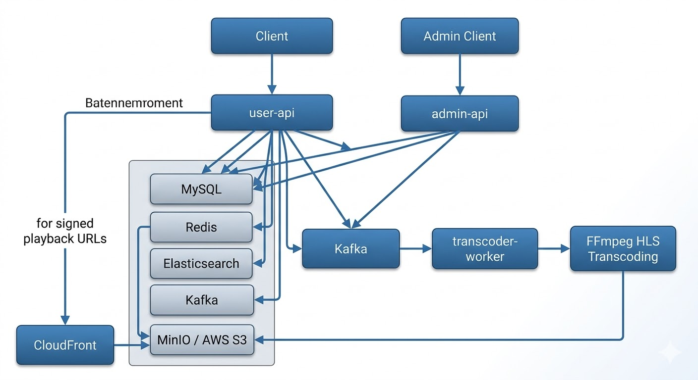

# U+ OTT 플랫폼 백엔드

> 정식 콘텐츠 스트리밍과 유저 숏폼 클립을 함께 제공하는 멀티 콘텐츠 OTT 서비스

**기간**: 2025.02.04 ~ 2025.03.19
---

## 팀 구성


|                                                      김우식                                                       |               서수민               |                                                                우수정                                                                |                                                            조성재                                                             |                                                       최가은                                                        |                                                           최보근                                                            |                                                      한상옥                                                       |
| :---------------------------------------------------------------------------------------------------------------: |:-------------------------------:|:---------------------------------------------------------------------------------------------------------------------------------:|:--------------------------------------------------------------------------------------------------------------------------:|:----------------------------------------------------------------------------------------------------------------:|:------------------------------------------------------------------------------------------------------------------------:|:--------------------------------------------------------------------------------------------------------------:|
| [<br/>@rladntlr](https://github.com/rladntlr) | [<br/>@s0ooooomin](https://github.com/s0ooooomin)               |      [<br/>@soojung122](https://github.com/soojung122)      | [<br/>@seongejae](https://github.com/seongejae)  |   [<br/>@eunii2](https://github.com/eunii2)    |[<br/>@ChoiBoKeun1](https://github.com/ChoiBoKeun1)| [<br/>@kay0307](https://github.com/kay0307) |
|                                                    **Backend**                                                    |     **Backend**      |                                                            **Backend**                                                            |                                                        **Backend**                                                         |                                                   **Backend**                                                    |                                                       **Backend**                                                        |                                                  **Backend**                                                   |
|회원/인증 · 검색/추천 · 장애 Fallback 설계|콘텐츠 · 플레이어|                                                            인증/회원 · 백오피스                                                            ||                                              백오피스 · 콘텐츠 · 트랜스코딩&ABR                                               |                                                콘텐츠 · 플레이어 · 실시간 인기차트 · 배포                                                |                                              마이페이지/플레이어성능 · 테스트 시연                                              |

---
## 배포

| | URL |
|--|-----|
| **Frontend** | https://utopiaott.vercel.app |
| **Backend API** | https://ureca-utopia.duckdns.org |
| **Swagger** | https://ureca-utopia.duckdns.org/swagger-ui/index.html |

---

## 기술 스택

| 분류 | 기술                                                  |
|------|-----------------------------------------------------|
| Language / Framework | Java 21, Spring Boot 4, Spring Security 6           |
| Database | MySQL 8.4 + Flyway, Redis 7, Elasticsearch 8 (Nori) |
| Messaging | Apache Kafka 3.7 (KRaft)                            |
| Storage / CDN | AWS S3, AWS CloudFront, FFmpeg                      |
| Infra | Docker, Docker Compose, GitHub Actions              |

---

## 시스템 구성



| 모듈                    | 역할 및 책임|주요기능|
|-----------------------|-------------------------------|------|
| `core`                | JWT·OAuth 보안, 스토리지 추상화, Kafka 이벤트 |JWT/OAuth2 보안 설정, Redis/Kafka 설정, S3/MinIO 스토리지 추상화 인터페이스, 공통 예외 처리|
| `domain`              | JPA 엔티티·리포지토리 (공유 도메인)        |JPA 엔티티 정의, Querydsl 리포지토리, 공통 서비스 로직 (사용자, 영상 메타데이터 등)|
| `user-api`            | 사용자 API 서버                    |영상 스트리밍 URL 생성(CloudFront Signed URL), 콘텐츠 검색(Elasticsearch), 캐싱 처리, 마이페이지 관리|
| `admin-api`           | 관리자 API 서버                    |신규 콘텐츠 업로드, 트랜스코딩 작업 트리거(Kafka Message 발행), 대시보드 및 통계 관리|
| `transcoder-worker`   | 비동기 영상 트랜스코딩 워커               |Kafka로부터 인코딩 메시지 수신, FFmpeg을 활용한 HLS 세그먼트 생성 및 S3 업로드|

---

## 주요 기능

### 인증
- 이메일 회원가입 4단계 멀티스텝 (Setup Token으로 서버 세션 없이 상태 전달)
- 소셜 로그인 (Google / Kakao / Naver), JWT Access(30분) + Refresh(14일) Rotation
- 로그인 5회 실패 시 Redis 기반 계정 잠금

### 콘텐츠 스트리밍
- 정식 콘텐츠(시리즈·영화): 구독자 전용 접근 제어, HLS 기반 스트리밍
- 유저 숏폼: 업로드 → Kafka → FFmpeg HLS 변환 → CloudFront 서명 URL 재생
- 에피소드별 `lastPositionSec` 저장으로 이어보기 지원

### 검색
- Elasticsearch Nori 형태소 분석 + 초성 검색 + 오타 교정 제안
- Redis 캐싱 자동완성 (TTL 24h)

### 추천
- **정식 콘텐츠**: 유저 선호 태그 기반 100차원 벡터 → ES kNN 후보 추출 → 태그유사도(60%) + 인기도(25%) + 신선도(15%) 내부 랭킹
- **숏폼 피드**: 마지막 시청 클립의 tagVector를 다음 쿼리 벡터로 재사용하는 seedId 기반 무한 스크롤
- ES 장애 시 DB 인기순 자동 폴백

### 기타
- 조회수 Redis Sorted Set 버퍼링 + ShedLock 배치 플러시
- 구독 결제 Redis 멱등성 키로 중복 결제 방지
- LG U+ 멤버십 전화번호 인증 연동

---

## 로컬 실행

```bash
# 1. 저장소 클론
git clone https://github.com/uplus-final-02/Back-end.git
cd Back-end

# 2. 인프라 실행 (MySQL, Redis, Kafka, Elasticsearch, MinIO)
docker compose up -d

# 3. 환경변수 설정
cp .env.example .env
# .env 파일에 JWT_SECRET, S3, OAuth 키 등 입력

# 4. 빌드 및 실행
./gradlew :modules:user-api:bootRun
```

> API 문서: http://localhost:8080/swagger-ui/index.html

---

## 트러블슈팅

---
## 추가할 내용